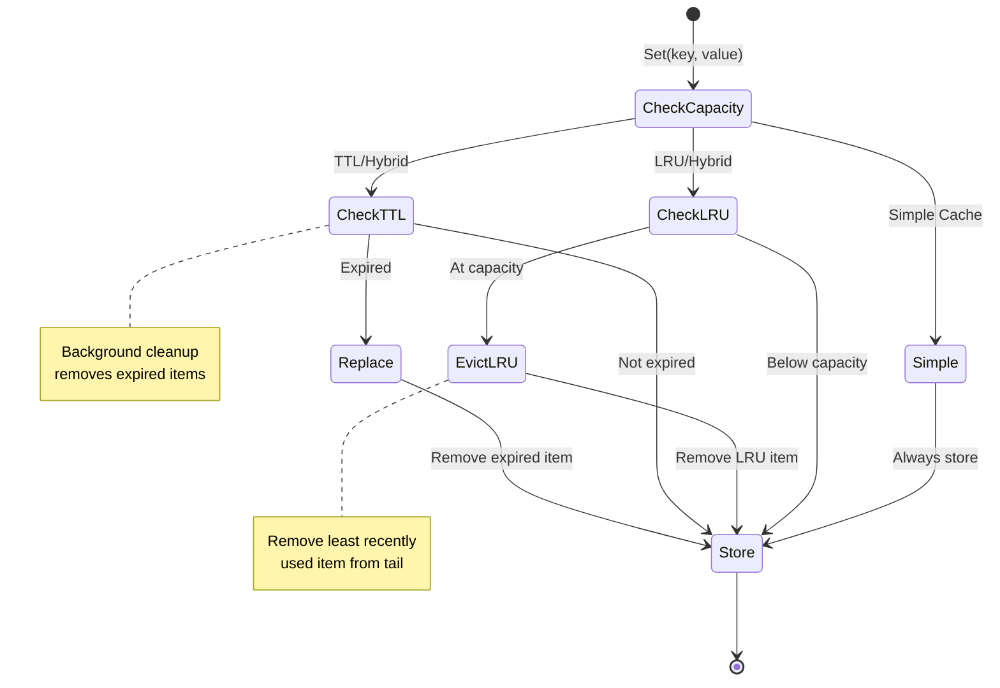

# Cache Package

A high-performance, thread-safe caching library for Go with multiple eviction policies, built-in statistics, and
optional Prometheus metrics integration.

## Features

- 🚀 **High Performance**: Optimized for concurrent access with minimal lock contention
- 📊 **Always Observable**: Statistics always enabled (never operate in the dark)
- 📈 **Prometheus Ready**: Optional metrics integration for production monitoring
- 🔧 **Flexible Eviction**: LRU, TTL, Hybrid, or no eviction policies
- 🎯 **Type-Safe**: Full generic support for any value type
- 🧩 **Functional Options**: Clean, composable configuration API

## Installation

```go
import "github.com/c360studio/semengine/internal/cache"
```

## Quick Start

### Basic Usage

Every constructor except `NewNoop` returns `(Cache[V], error)`, and the cache is nil when the error is not: check the
error before using the cache.

```go
// Simple cache with default settings (stats always enabled)
names, err := cache.NewSimple[string]()
if err != nil {
    return err
}

// LRU cache with max 1000 items
items, err := cache.NewLRU[*MyStruct](1000)
if err != nil {
    return err
}

// TTL cache with 5-minute expiry and 1-minute cleanup interval
counts, err := cache.NewTTL[int](ctx, 5*time.Minute, 1*time.Minute)
if err != nil {
    return err
}

// Hybrid cache combining LRU and TTL (built from a Config; there is no direct hybrid constructor)
hybrid, err := cache.NewFromConfig[string](ctx, cache.Config{
    Enabled: true, Strategy: cache.StrategyHybrid,
    MaxSize: 1000, TTL: 5 * time.Minute, CleanupInterval: 1 * time.Minute,
})
if err != nil {
    return err
}
```

### With Prometheus Metrics

```go
import "github.com/c360studio/semengine/metric"

// Create metrics registry
registry := metric.NewMetricsRegistry()

// Create cache with metrics export
c, err := cache.NewLRU[*Entity](1000,
    cache.WithMetrics[*Entity](registry, "my_component"),
)
if err != nil {
    return err
}

// Metrics automatically exported:
// - semengine_cache_hits_total{component="my_component"}
// - semengine_cache_misses_total{component="my_component"}
// - semengine_cache_size{component="my_component"}
// - etc.
```

### With Multiple Options

```go
// Compose multiple functional options
c, err := cache.NewTTL[*Document](ctx, 10*time.Minute, 1*time.Minute,
    cache.WithMetrics[*Document](registry, "document_cache"),
)
if err != nil {
    return err
}
```

## Cache Types

Each constructor below returns an error; check it before using `c`, as in Quick Start.

### Simple Cache

No eviction policy - items remain until explicitly deleted.

```go
c, err := cache.NewSimple[V]()
```

### LRU Cache

Evicts least recently used items when capacity is reached.

```go
c, err := cache.NewLRU[V](maxSize)
```

### TTL Cache

Evicts items after a time-to-live period expires.

```go
c, err := cache.NewTTL[V](ctx, ttl, cleanupInterval)
```

### Hybrid Cache

Combines LRU and TTL - evicts items that are either expired or least recently used.

```go
c, err := cache.NewFromConfig[V](ctx, cache.Config{
    Enabled: true, Strategy: cache.StrategyHybrid,
    MaxSize: maxSize, TTL: ttl, CleanupInterval: cleanupInterval,
})
```

## Functional Options

The cache package uses functional options for clean, composable configuration:

### WithMetrics

Enable Prometheus metrics export:

```go
cache.WithMetrics[V](registry, "component_name")
```

## API Reference

### Cache Interface

```go
type Cache[V any] interface {
    Get(key string) (V, bool)                // Retrieve value by key
    Set(key string, value V) (bool, error)   // Store; true when a new entry was created
    Delete(key string) (bool, error)         // Remove; true when the key existed
    Clear() error                            // Remove all entries
    Size() int                               // Current number of entries
    Keys() []string                          // All keys currently in cache
    Stats() *Statistics                      // Cache statistics; nil for the no-op cache
    Close() error                            // Stop background work (the TTL and hybrid cleanup goroutine)
}
```

### Statistics

Statistics are **always** collected (not optional) by the simple, LRU, TTL and hybrid caches. The no-op cache
(`NewNoop`, and `NewFromConfig` with `Enabled: false`) stores nothing and its `Stats()` is nil.

```go
stats := c.Stats()

// Available metrics:
stats.Hits()              // Total cache hits
stats.Misses()            // Total cache misses  
stats.HitRatio()          // Hit rate (0.0 to 1.0)
stats.RequestsPerSecond() // Throughput
stats.CurrentSize()       // Current entries
stats.Evictions()         // Total evictions
```

## Prometheus Metrics

When enabled via `WithMetrics()`, the following metrics are exported:

| Metric | Type | Description |
|--------|------|-------------|
| `semengine_cache_hits_total` | Counter | Total cache hits |
| `semengine_cache_misses_total` | Counter | Total cache misses |
| `semengine_cache_sets_total` | Counter | Total set operations |
| `semengine_cache_deletes_total` | Counter | Total delete operations |
| `semengine_cache_evictions_total` | Counter | Total evictions |
| `semengine_cache_size` | Gauge | Current number of entries |

All metrics include a `component` label for identifying different cache instances.

## Configuration-Driven Cache Creation

The `NewFromConfig()` function enables cache creation from configuration files (YAML/JSON):

```go
// Load from config file
config := cache.Config{
    Enabled:         true,
    Strategy:        cache.StrategyLRU,
    MaxSize:         1000,
    TTL:             5 * time.Minute,
    CleanupInterval: 1 * time.Minute,
}

// Create cache from config with optional functional options
c, err := cache.NewFromConfig[V](ctx, config,
    cache.WithMetrics[V](registry, "component_name"),
)
```

This pattern is useful for:

- Runtime cache strategy selection
- Deployment-specific tuning without code changes
- Configuration files (YAML/JSON) that specify cache behavior

## Performance

Benchmark results on MacBook Pro M3:

```text
BenchmarkCacheGet/Simple-12         6,846,386    172.8 ns/op
BenchmarkCacheGet/LRU_1000-12       5,310,026    226.6 ns/op
BenchmarkCacheGet/TTL-12            5,605,714    213.5 ns/op
BenchmarkCacheGet/Hybrid_1000-12    4,665,702    257.2 ns/op

BenchmarkCacheSet/Simple-12         4,666,502    256.8 ns/op
BenchmarkCacheSet/LRU_1000-12       3,477,819    361.4 ns/op
BenchmarkCacheSet/TTL-12            3,702,312    324.1 ns/op
BenchmarkCacheSet/Hybrid_1000-12    3,161,434    379.3 ns/op
```

### Performance Tips

1. **Metrics Overhead**: ~5% when enabled, zero when disabled
2. **Stats Overhead**: Negligible (atomic operations)
3. **Lock Contention**: Use multiple cache instances for high-concurrency scenarios
4. **Memory**: Consider item size when setting max capacity

## Architecture

### Observability: Dual Tracking Pattern

The cache package tracks operations through two independent systems:

```mermaid
flowchart LR
    A[Cache Operation] --> B[Statistics]
    A --> C[Metrics]

    B --> D[Atomic Counters]
    B --> E[Computed Values]

    C --> F[Prometheus Counters]
    C --> G[Prometheus Gauges]

    D --> H[cache.Stats API]
    E --> H

    F --> I[/metrics endpoint]
    G --> I

    style A fill:#e1f5ff
    style B fill:#d4edda
    style C fill:#fff3cd
    style H fill:#d4edda
    style I fill:#fff3cd
```

**Why Track Twice?**

Both Statistics and Metrics independently track operations, which appears redundant but serves distinct purposes:

| Aspect | Statistics (Always On) | Metrics (Optional) |
|--------|------------------------|-------------------|
| **Purpose** | Local debugging & programmatic access | Time-series monitoring & dashboards |
| **Dependency** | None (atomic operations) | Prometheus registry |
| **Computed Values** | Hit ratio, requests/sec | Raw counters/gauges only |
| **Access** | `cache.Stats()` API | `/metrics` HTTP endpoint |
| **Overhead** | ~50ns/op | ~50ns/op (when enabled) |
| **Use Case** | Tests, debugging, runtime inspection | Production dashboards, alerting |

**Performance Trade-off:**

- Dual tracking overhead: **~5% per operation** when metrics enabled
- At 1M ops/sec: **0.5-1% total overhead**
- Negligible cost for comprehensive observability

**Alternative Considered:** Reading Statistics from Prometheus metrics to avoid duplication.

**Rejected because:**

- Creates Prometheus dependency for basic stats
- 10x slower (reading from Prometheus vs atomic operations)
- Breaks Statistics when metrics disabled
- Violates separation of concerns

### Cache Architecture by Type

```mermaid
flowchart TB
    subgraph Simple["Simple Cache (No Eviction)"]
        S1[Map: key → value]
    end

    subgraph LRU["LRU Cache (Capacity-Based)"]
        L1[Map: key → list element]
        L2[Doubly-Linked List]
        L1 --> L2
        L2 -.->|"Move to front on access"| L2
        L2 -.->|"Evict tail when full"| L2
    end

    subgraph TTL["TTL Cache (Time-Based)"]
        T1[Map: key → entry]
        T2[Expiry: key → timestamp]
        T3[Cleanup Goroutine]
        T1 --> T2
        T3 -.->|"Periodic scan"| T2
    end

    subgraph Hybrid["Hybrid Cache (Capacity + Time)"]
        H1[Map: key → list element]
        H2[Doubly-Linked List]
        H3[Expiry: key → timestamp]
        H4[Cleanup Goroutine]
        H1 --> H2
        H1 --> H3
        H4 -.->|"Periodic scan"| H3
        H2 -.->|"LRU eviction"| H2
    end

    style Simple fill:#e1f5ff
    style LRU fill:#d4edda
    style TTL fill:#fff3cd
    style Hybrid fill:#f8d7da
```



### Eviction Policy Flow



### Architecture Decisions

#### Why Stats Are Always On

Statistics collection is mandatory because:

- **Observability is critical** for production systems
- **Negligible overhead** (atomic operations ~50ns)
- **Debugging without stats** is nearly impossible
- **Hit ratios** inform capacity planning and eviction policy tuning
- **No external dependencies** required for basic monitoring

#### Why Functional Options

We chose functional options over struct-based configuration because:

- **More idiomatic Go** pattern
- **Composable and extensible** - easy to add features
- **Clear intent** with named functions
- **No zero-value confusion** in configuration
- **Backward compatible** when adding new options

#### Why Multiple Cache Types

Different eviction strategies serve different use cases:

- **Simple**: Explicit control, no automatic eviction
- **LRU**: Access pattern optimization, fixed capacity
- **TTL**: Time-sensitive data, automatic expiration
- **Hybrid**: Production-grade caching with both limits

## Examples

### Production Cache with Full Monitoring

```go
func setupProductionCache(ctx context.Context, registry *metric.MetricsRegistry) (cache.Cache[*User], error) {
    return cache.NewFromConfig[*User](ctx, cache.Config{
        Enabled:         true,
        Strategy:        cache.StrategyHybrid,
        MaxSize:         10000,           // Max 10k users
        TTL:             30 * time.Minute, // 30 min TTL
        CleanupInterval: 5 * time.Minute,  // Cleanup every 5 min
    }, cache.WithMetrics[*User](registry, "user_cache"))
}
```

### Request-Scoped Cache

```go
func handleRequest(keys []string) error {
    // Create a request-scoped cache
    requestCache, err := cache.NewLRU[*ComputedResult](100)
    if err != nil {
        return err
    }
    defer requestCache.Close()

    // Use cache during request processing
    for _, key := range keys {
        if _, ok := requestCache.Get(key); ok {
            continue
        }
        // Compute and cache
        if _, err := requestCache.Set(key, expensiveComputation(key)); err != nil {
            return err
        }
    }
    return nil
}
```

## Thread Safety

All cache operations are thread-safe. The implementation uses:

- Fine-grained locking with `sync.RWMutex`
- Atomic operations for statistics
- Lock-free reads where possible

## Contributing

When adding new cache implementations:

1. Statistics must always be initialized
2. Follow functional options pattern
3. Support optional Prometheus metrics
4. Maintain thread safety
5. Include comprehensive tests with race detection

## License

See LICENSE file in repository root.
